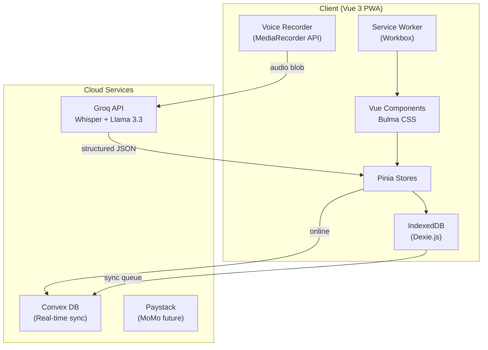
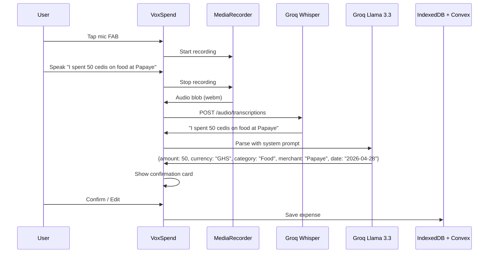

# VoxSpend — Voice-First Expense Tracker

**Tagline:** "Track spending with your voice."

A mobile-first PWA for Ghanaian users that lets them add expenses by speaking naturally. Powered by Groq AI for instant voice-to-structured-data, backed by Convex for real-time cloud sync, and resilient offline via IndexedDB.

---

## User Review Required

> [!IMPORTANT]
> **Groq API Key**: The app will need a Groq API key for voice transcription (Whisper) and LLM parsing (Llama 3.3). Build the onboarding to prompt for it!

> [!IMPORTANT]
> **Convex Account**: Convex requires a free account and project. Set up a Convex account!

> [!WARNING]
> **Mobile Money (Paystack)**: Direct mobile money linking (read transaction history from MTN/Telecel/AirtelTigo) is **not publicly available** via any API. What we _can_ do is:
>
> 1. **Manual linking** — User enters their MoMo number and provider; the app tracks expenses tagged to that account.
> 2. **Payment collection via Paystack** — If the app ever needs to collect payments (e.g., premium subscription), Paystack supports Ghana MoMo checkout.
> 3. **SMS parsing** (future) — On Android, a native wrapper could read MoMo SMS confirmations to auto-log transactions.
>
> For this MVP, I'll implement **option 1** (manual MoMo account linking with provider branding) and prepare the Paystack integration hook for future use.

> [!IMPORTANT]
> **Authentication**: The reference designs show a user avatar, implying auth. Implement:
>
> - **(A)** Simple local-only profile (name + avatar, stored locally, no login) — fastest
> - **(B)** Convex Auth (email/password or OAuth) — real multi-device sync
>
> Will choose **(A)** for MVP, upgrading to **(B)** later!

---

## Open Questions

1. **Budget / Savings Targets**: Reference UIs show "Savings targets" (home, car, trip). Will Focus purely on expense tracking + voice now. Include a savings goals feature later!
2. **Income tracking**: The references show an "Incomes" card. The app could track income as well!
3. **Export**: Do you need CSV/PDF export of expense data? CSV is optimal.
4. **Categories**: Should categories be user-customizable, or is a fixed set sufficient (Food, Transport, Utilities, Health, Education, Entertainment, Family, Shopping, Other)? 🤔 User-customizable!

---

## Architecture Overview



### Data Flow — Voice Expense Entry



---

## Tech Stack Details

| Layer      | Technology                  | Purpose                          |
| ---------- | --------------------------- | -------------------------------- |
| Framework  | Vue 3 + TypeScript          | SPA framework                    |
| State      | Pinia                       | Reactive state management        |
| Styling    | Bulma CSS + SCSS            | Neumorphic / glassmorphic UI     |
| Cloud DB   | Convex                      | Real-time serverless database    |
| Local DB   | Dexie.js (IndexedDB)        | Offline-first local persistence  |
| AI — STT   | Groq Whisper large-v3-turbo | Voice transcription              |
| AI — Parse | Groq Llama 3.3 70B          | Structured expense extraction    |
| Voice      | MediaRecorder API           | Browser audio capture            |
| PWA        | vite-plugin-pwa + Workbox   | Service worker, caching, install |
| Payments   | Paystack (future)           | MoMo checkout                    |
| Router     | Vue Router 4                | SPA navigation                   |
| Charts     | Chart.js + vue-chartjs      | Donut/bar charts                 |

---

## Proposed Changes

### Phase 1 — Project Scaffold & Design System

#### [NEW] package.json / vite.config.ts / tsconfig.json

- Scaffold with `npm create vue@latest` (Vue 3 + TS + Pinia + Router)
- Install: `bulma`, `sass`, `dexie`, `convex`, `convex-vue`, `vite-plugin-pwa`, `chart.js`, `vue-chartjs`, `groq-sdk`
- Configure Vite with PWA plugin, SCSS, path aliases

#### [NEW] src/assets/scss/main.scss

- Bulma variable overrides: primary color `#2D7FF9` (the blue from reference), dark mode tokens
- Neumorphic utility classes (soft shadows, inset shadows, rounded cards)
- Custom component styles beyond Bulma defaults
- CSS custom properties for light/dark theming

#### [NEW] src/assets/scss/\_variables.scss

- Color palette: blues, accent cyan `#00D4AA`, warning amber, category colors (blue, purple, pink, yellow, cyan)
- Neumorphic shadow values for light and dark
- Typography scale using Inter font

#### [NEW] src/assets/scss/\_neumorphic.scss

- `.neo-card`, `.neo-card-inset`, `.neo-button`, `.neo-fab` utility classes
- Light mode: `box-shadow: 6px 6px 12px #d1d9e6, -6px -6px 12px #ffffff`
- Dark mode: `box-shadow: 6px 6px 12px #1a1a2e, -6px -6px 12px #2a2a4a`

#### [NEW] public/manifest.json + PWA icons

- App name: "VoxSpend"
- Theme color, background color, display: standalone
- Icon set (192, 512)

---

### Phase 2 — Local-First Data Layer

#### [NEW] src/services/database.ts

- Dexie.js database class `VoxSpendDB`
- Tables: `expenses`, `categories`, `momoAccounts`, `syncQueue`, `settings`
- Schema with auto-incrementing IDs + UUID fields for Convex sync
- Version migrations

#### [NEW] src/services/offlineSync.ts

- `SyncManager` class
- On mutation → write to IndexedDB immediately + push to `syncQueue`
- On connectivity restored → process `syncQueue` → push to Convex
- Conflict resolution: last-write-wins with timestamps
- Network status detection via `navigator.onLine` + `online`/`offline` events

#### [NEW] src/stores/expenses.ts (Pinia)

- State: `expenses[]`, `loading`, `syncing`
- Actions: `addExpense()`, `updateExpense()`, `deleteExpense()`, `fetchExpenses()`
- All writes go to IndexedDB first (instant), then sync to Convex
- Getters: `totalExpenses`, `expensesByCategory`, `expensesByDate`, `monthlyTotal`

#### [NEW] src/stores/categories.ts (Pinia)

- Default categories with colors and icons:
  - 🍽️ Food (`#2D7FF9`), 👨‍👩‍👧 Family (`#8B5CF6`), 🎭 Entertainment (`#F43F5E`),
  - 📚 Study (`#F59E0B`), 🚗 Transport (`#10B981`), 💡 Utilities (`#06B6D4`),
  - 🏥 Health (`#EC4899`), 🛒 Shopping (`#6366F1`), 📱 Other (`#64748B`)

#### [NEW] src/stores/user.ts (Pinia)

- Local profile: name, avatar, preferred currency (GHS default)
- Theme preference (light/dark/system)
- Groq API key storage (encrypted in localStorage)

#### [NEW] src/stores/theme.ts (Pinia)

- `mode`: 'light' | 'dark' | 'system'
- Applies `data-theme` attribute to document root
- Persists preference

#### [NEW] convex/schema.ts

- Convex table schemas matching local DB
- `expenses`: amount, currency, category, merchant, note, date, momoAccountId, syncId, createdAt, updatedAt
- `categories`: name, color, icon, isCustom
- `momoAccounts`: provider, phoneNumber, nickname

#### [NEW] convex/expenses.ts

- `list` query — all expenses for user, sorted by date desc
- `create` mutation — insert expense
- `update` mutation — update expense
- `remove` mutation — soft delete

---

### Phase 3 — Voice & AI Pipeline

#### [NEW] src/services/voiceRecorder.ts

- Composable `useVoiceRecorder()`
- `startRecording()` → request mic permission, create MediaRecorder (webm/opus)
- `stopRecording()` → return audio Blob
- `cancelRecording()` → discard
- Reactive state: `isRecording`, `duration`, `audioLevel` (for waveform viz)
- Audio level via `AnalyserNode` for real-time waveform animation

#### [NEW] src/services/groqService.ts

- `transcribeAudio(blob: Blob): Promise<string>` — POST to Groq Whisper endpoint
- `parseExpense(transcript: string): Promise<ParsedExpense>` — Chat completion with Llama 3.3
- System prompt for parsing:
  ```
  You are an expense parser for a Ghanaian user. Extract structured data from spoken expense descriptions.
  Primary currency: GHS (Ghana Cedis).
  Return JSON: { amount, currency, category, merchant, note, date }
  Categories: Food, Family, Entertainment, Study, Transport, Utilities, Health, Shopping, Other
  If the user mentions "cedis" or "cedi", currency is GHS.
  If no date mentioned, use today.
  ```
- Offline fallback: queue audio blobs in IndexedDB for processing when online

#### [NEW] src/stores/voice.ts (Pinia)

- State: `isRecording`, `isProcessing`, `transcript`, `parsedExpense`, `error`
- Actions: `startRecording()`, `stopAndProcess()`, `confirmExpense()`, `editAndConfirm()`
- Manages the full lifecycle from tap → record → transcribe → parse → confirm → save

---

### Phase 4 — UI Components & Views

#### App Shell

##### [NEW] src/App.vue

- Root layout with `<router-view>` and `<BottomNav>`
- Theme provider (applies dark/light class)
- PWA install prompt handler
- Online/offline status indicator

##### [NEW] src/components/BottomNav.vue

- 5 tabs: Home, Analytics, _(center FAB mic)_, History, Profile
- Neumorphic pill-shaped bar with glassmorphism
- The center button is the **voice FAB** — tapping opens VoiceInputModal
- Active tab indicator with smooth transition

##### [NEW] src/components/VoiceInputModal.vue

- Full-screen bottom sheet modal
- States: idle → recording (pulsing mic animation + waveform) → processing (spinner) → confirm (parsed expense card)
- Waveform visualization using canvas + AnalyserNode data
- Confirm/Edit/Cancel actions
- Haptic feedback via `navigator.vibrate()`

##### [NEW] src/components/StatusBar.vue

- Offline indicator banner (subtle yellow bar when offline)
- Syncing indicator (subtle blue pulse when syncing)

---

#### Dashboard (Home) View

##### [NEW] src/views/DashboardView.vue

- Header: greeting + user avatar
- Hero card: "Your balance" with total in GHS, neumorphic
- Income/Expense summary cards side-by-side with percentage badges
- "Recent expenses" list (last 5)
- Quick category chips

##### [NEW] src/components/BalanceCard.vue

- Large GHS amount display
- Subtle gradient background
- Income (green badge +%) and Expense (red badge -%) sub-cards

##### [NEW] src/components/ExpenseItem.vue

- Category icon/color dot + merchant name + date/time + amount
- Neumorphic card style matching references
- Swipe-to-delete (future)

---

#### Expenses / Analytics View

##### [NEW] src/views/ExpensesView.vue

- Header: "Expenses" + month selector dropdown
- Donut chart (Chart.js) — category breakdown with total in center
- Left/right arrows to navigate months
- Category list below chart: color dot + name + percentage + amount
- Each category row is a neumorphic card

##### [NEW] src/components/DonutChart.vue

- Vue-chartjs doughnut with center text (total amount)
- Animated on mount
- Category colors matching the design (blue, purple, pink, yellow)
- Responsive sizing

---

#### History View

##### [NEW] src/views/HistoryView.vue

- Header: "History" + month/calendar picker
- Grouped by date: "Today", "Yesterday", specific dates
- Each group is a neumorphic section
- Expense items with merchant icon, name, datetime, amount
- Positive amounts (income) in green, negative (expense) in default

##### [NEW] src/views/TransactionDetailView.vue

- Back button + edit icon
- Merchant header with logo/icon
- Date/time
- Line items (if available from voice parsing)
- Subtotal, taxes, discounts, total
- Receipt-style card with torn-edge bottom (CSS)
- Delete / Edit actions

---

#### Profile / Settings View

##### [NEW] src/views/ProfileView.vue

- User avatar + name
- Theme toggle (light/dark/system)
- Linked MoMo accounts section
- Groq API key management (show/hide + edit)
- Data management: export, clear local data
- About section with app version

---

#### Mobile Money

##### [NEW] src/views/MomoLinkView.vue

- "Link Mobile Money" header
- Provider cards: MTN (yellow), Telecel (red), AirtelTigo (blue/red)
- Each card: provider logo, name, link/unlink button
- On link: enter phone number + nickname
- Linked accounts list with unlink option

##### [NEW] src/components/MomoProviderCard.vue

- Provider branding (color + logo)
- Phone number display
- Status: linked/unlinked
- Tap to link → phone number input

##### [NEW] src/stores/momo.ts (Pinia)

- State: `accounts[]` (provider, phoneNumber, nickname, linkedAt)
- Actions: `linkAccount()`, `unlinkAccount()`
- Persisted in IndexedDB

---

#### Onboarding

##### [NEW] src/views/OnboardingView.vue

- 3-slide carousel:
  1. "Track spending with your voice" — mic illustration
  2. "AI-powered insights" — chart illustration
  3. "Works offline" — cloud-off illustration
- "Get Started" button → setup name + API key
- Skip option

##### [NEW] src/views/SetupView.vue

- Enter your name
- Enter Groq API key (with link to get one)
- Optional: link MoMo account
- "Start Tracking" button

---

### Phase 5 — PWA & Polish

#### [NEW] src/sw.ts (Custom service worker)

- Precache app shell
- Runtime cache for Groq API responses
- Background sync for offline expense queue
- Push notification setup (future)

#### [MODIFY] vite.config.ts

- `injectManifest` strategy for custom SW
- Workbox runtime caching rules

#### [NEW] src/composables/useOnlineStatus.ts

- Reactive `isOnline` ref
- Listeners for `online`/`offline` events
- Exposes `isOnline`, `lastOnline` timestamp

#### [NEW] src/composables/usePwaInstall.ts

- Capture `beforeinstallprompt` event
- `canInstall`, `promptInstall()` for install banner

#### [NEW] src/router/index.ts

- Routes: `/`, `/expenses`, `/history`, `/history/:id`, `/profile`, `/momo`, `/onboarding`, `/setup`
- Navigation guards: redirect to onboarding if first launch

---

## File Structure

```
eco-expense/
├── convex/
│   ├── schema.ts
│   ├── expenses.ts
│   └── tsconfig.json
├── public/
│   ├── icons/
│   │   ├── icon-192.png
│   │   └── icon-512.png
│   └── favicon.ico
├── src/
│   ├── assets/
│   │   └── scss/
│   │       ├── main.scss
│   │       ├── _variables.scss
│   │       ├── _neumorphic.scss
│   │       └── _dark-theme.scss
│   ├── components/
│   │   ├── BottomNav.vue
│   │   ├── VoiceInputModal.vue
│   │   ├── BalanceCard.vue
│   │   ├── ExpenseItem.vue
│   │   ├── DonutChart.vue
│   │   ├── MomoProviderCard.vue
│   │   ├── StatusBar.vue
│   │   └── CategoryChip.vue
│   ├── composables/
│   │   ├── useOnlineStatus.ts
│   │   └── usePwaInstall.ts
│   ├── services/
│   │   ├── database.ts
│   │   ├── offlineSync.ts
│   │   ├── groqService.ts
│   │   └── voiceRecorder.ts
│   ├── stores/
│   │   ├── expenses.ts
│   │   ├── categories.ts
│   │   ├── user.ts
│   │   ├── theme.ts
│   │   ├── voice.ts
│   │   └── momo.ts
│   ├── views/
│   │   ├── DashboardView.vue
│   │   ├── ExpensesView.vue
│   │   ├── HistoryView.vue
│   │   ├── TransactionDetailView.vue
│   │   ├── ProfileView.vue
│   │   ├── MomoLinkView.vue
│   │   ├── OnboardingView.vue
│   │   └── SetupView.vue
│   ├── router/
│   │   └── index.ts
│   ├── types/
│   │   └── index.ts
│   ├── App.vue
│   ├── main.ts
│   └── sw.ts
├── index.html
├── vite.config.ts
├── tsconfig.json
└── package.json
```

---

## Verification Plan

### Automated Tests

- `npm run build` — verify TypeScript compilation and Vite production build
- `npm run dev` — verify dev server starts and app loads
- Browser test: navigate all routes, verify rendering

### Manual Verification (Browser)

1. **Voice flow**: Tap mic → speak → see transcript → see parsed expense → confirm → expense appears in history
2. **Offline resilience**: Toggle offline in DevTools → add expense via voice (should queue) → go online → verify sync
3. **Dark/Light mode**: Toggle theme → verify all views render correctly in both
4. **PWA install**: Build + preview → verify install prompt on mobile Chrome
5. **MoMo linking**: Add/remove MoMo accounts → verify persistence
6. **Responsive**: Test at 375px (iPhone SE), 390px (iPhone 14), 412px (Pixel) widths

### Visual Verification

- Compare rendered UI against reference screenshots
- Verify neumorphic shadows, color palette, typography
- Check donut chart rendering and animations

---

## Delivery Phases

| Phase | Scope                                | Files     |
| ----- | ------------------------------------ | --------- |
| 1     | Scaffold + Design System             | ~8 files  |
| 2     | Data Layer (Dexie + Convex + Stores) | ~10 files |
| 3     | Voice & AI Pipeline                  | ~4 files  |
| 4     | All UI Views & Components            | ~16 files |
| 5     | PWA, Offline Sync, Polish            | ~5 files  |

I'll build in this order, verifying each phase before moving to the next.
